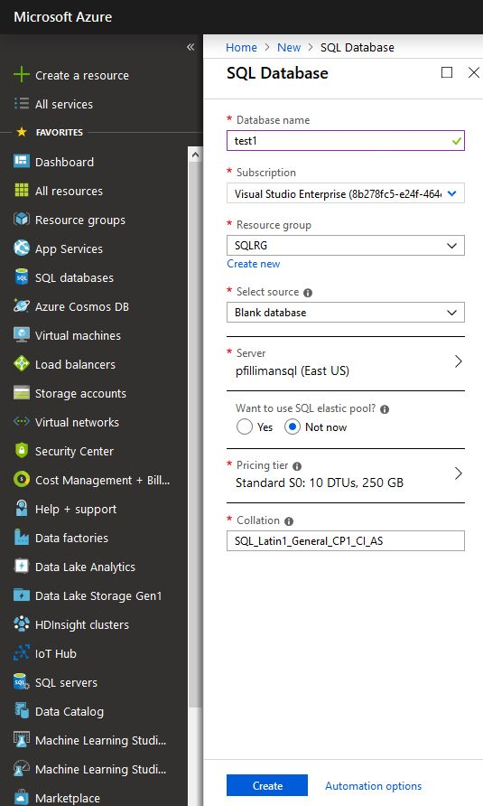
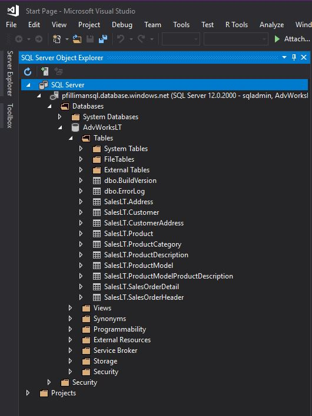

# Azure Data Services :hand: fa18-516-06

| Paul Filliman
| pfillima@iu.edu
| Indiana University
| hid: fa18-516-06
| github: [:cloud:](https://github.com/cloudmesh-community/fa18-516-06/blob/master/paper/paper.md)

---

Keywords: Azure

---

## Abstract

This chapter focuses on an overview of the many data services within the Microsoft Azure cloud. We detail the different relational and non-relational NoSQL databases as well as the many data analytics services.

## Database Products

### Azure SQL Database

#### Overview

The Azure SQL database is the cloud-based, SQL Server database as a service, relational database engine using the latest version of the SQL Server. There are many advantages to using an Azure SQL database as opposed to an on-premises SQL Server database platform. There are also many pricing level choices based on a function of hardware resources used.

#### Advantages

The biggest advantage to using an Azure SQL database rather than an on-premesis SQL database is scalability. Users can choose from many options of pricing model depending upon the utilization of their needs. Companies can start out with a low cost Azure SQL database having a fully managed database platform without the expense of an on-premises server and administrative costs and quickly scale up to a higher-cost pricing model with expanded system resources. Other major benefits are database high availability and low administrative duties with operational database administrator or Windows server administration duties [fa18-516-06-AzureSQL2].

#### Pricing Models

There are two purchasing models. The Database Transaction Unit (DTU) based model and the vCore based model. The DTU model uses a measure using a combination of "compute, memory, and storage" [fa18-516-06-AzureSQL1]. In the DTU purchasing model, users can choose from three different configurations, Basic, Standard, and Premium, corresponding to the extent of the needed resources. Within the vCore model, users can individually choose the compute, memory, and storage values. The Gen4 generation allows for up to 24 virtual CPU cores and 168 GB memory and the Gen5 generation allows for up to 80 virtual cores and 408 GB memory. The maximum data size within the Gen4 is 1 TB and with Gen5 it is 4 TB.

#### Creating an Azure SQL Database

The creation of an Azure SQL database is very easy:

1. Log in to the Azure portal
2. From the Azure portal, select "Create a Resource", then choose "SQL Database" within "Databases"
3. Enter the name of the database to create
4. Enter the container for the resource group, create a new resource group, if desired
5. Choose if this created database will use an elastic poolcode-example
6. Select the pricing model
7. Click the "Create" button

{#fig:create-azure-sql}

Once the database has been created, we can use Microsoft Visual Studio as the development tool to the new Azure SQL database, much like an on-premesis database using SQL Server Management Studio, as shown in +@fig:azure-sql.

{#fig:azure-sql}

### Azure MySQL, PostgreSQL, and MariaDB Databases

Within the Azure ecosystem, it is possible to use three different open-source databases, MySQL, PostgreSQL, and MariaDB. Each of these are the cloud-based community versions of the databases. Much like Azure SQL, these have the benefits of using a cloud-based database service, for example scalability and uptime. These Azure relational database allow users to keep using their desired open-source database platforms in the Azure cloud environment [fa18-516-06-AzureOpenSourceDB].

### Azure Cosmos DB

The Azure Cosmos DB offers various multimodel, highly available databases for world-wide use. Cosmos DB supports many NoSQL data models including document, graph, key-value, and column-family models and is built on the "atom-record-sequence" data model which supports many APIs including MongoDB, Cassandra, Gremlin, and SQL [fa18-516-06-AzureCosmosDB1].

Cosmos DB uses "turnkey global distribution" by distributing data near to where the current users are located to enable low network latency. This is done through the "multi-homing APIs" where an application is aware of the location of the application user and can move data to the closest Azure region [fa18-516-06-AzureCosmosDB1].

Cosmos DB service has high availability and throughput service level agreements, including a 99.999% availability and IO reads of less than 10 ms and IO writes of under 15 ms [fa18-516-06-AzureCosmosDB2]. Users needing a highly available NoSQL database at a global scale, such as global web application databases, could gain from using Cosmos DB.

### Azure SQL Data Warehouse

The Azure SQL Data Warehouse is a cloud-based, data warehouse that uses massive parallel processing for use with querying large amounts of data. The Azure SQL Data Warehouse uses Azure virtual machines for the compute nodes and Azure page blobs for storage. This separation allows for scalability for compute and storage independently [fa18-516-06-AzureSQLDataWarehouse1].

One of strengths of Azure SQL Data Warehouse is its ability to ingest modern data sources, for example datalakes and Hadoop as shown in the figure below. With the ability of using Polybase, a user can query non-relation as well as relation data sources that are stored in Azure SQL Data Warehouse [fa18-516-06-AzureSQLDataWarehouse2]. Various Azure services can be used having the Azure SQL Data Warehouse as a source, including Azure Analysis Services, other Azure SQL Data Warehouses, and Azure SQL Databases.

![:o: CAPTION MISSING LABEL MISSING [@fa18-516-06-AzureSQLDataWarehouse3] ](images/Azure_SQLDW1.jpg)

Another strength is the ability to only use this service during a particular time of day or week. If the data warehouse user only need access during a regular work week, this could save cost rather than running this service all of the time. Much like Azure SQL Database described above, this has high-avilability and backup and recoverability features as well [fa18-516-06-AzureSQLDataWarehouse1].

## Analytics
        
### Azure HDInsight

HDInsight is the Azure services for clustering Apache Hadoop, Apache Spark, Kafka, Apache HBase, Hive, and Storm and are built around the Hortonworks Data Platform. The concepts of the Hadoop ecosystem go beyond the scope of this chapter, but this section is an overview of the different HDInsight services available and how they can be used within Azure.

Azure HDInsight services are typically used when working with massive amounts of data in the internet of things and streaming real-time analytics scenarios. There are many ways under the HDInsight umbrella to setup clusters according to business needs. The following show  for example configuring clusters using Apache Spark for parallel processing or Apache Storm for use with real-time streaming analytics. Apache HBase can be clustered in Azure for businesses needing a NoSQL database to store unstructured or semi-structured data. HBase brings very large tables having billions of rows and millions of columns. Apache Kafka can also be clustered under Azure HDInsight. Apache Kafka is a popular platform for streaming pipelines [fa18-516-06-Azure_HDInsightClustering].

The following figure shows HDInsight within a modern data warehouse. There are multiple data sources from log files, and structured and unstructured data as batch processes for the HDInsight data sources. These data are into Azure Storage or Azure Data Lake Stores. Spark and HiveQL can then be used to query the Azure storage and these can be used to build business intelligence data models, for example Azure Analysis Services models. Finally, these data can be visualized using PowerBI.

The next figure shows Azure HDInsight in an Internet of Things scenario. Various IoT streams can be fed into IoT hubs then read into HDInsight using the Storm, Kafka, or Spark services, then real-time visualizations or applications can be fed data from HDInsight.

One the of the strengths of HDInsight is that these services are available in Azure without the work of implementing these clusters in on-premesis servers and also having seamless integration with other Azure services. These services have high performance, five nines (99.999%) SLA and can be used on a per-use basis therefore cutting costs of permanent uptime.

### Azure Stream Analytics

The Azure Stream Analytics service processes output from various IoT sources and can be used to analyze real-time data. Real-time data analytics is needed when data is in movement, for example, in cases such as detecting fraudlent bank transactions before the account is deducted. In past analytic systems, where an ETL load happened once per day, this system could not detect this transaction in real-time. Azure Stream Analytics is the service that manages these continuous real-time output.

Azure Stream Analytics is a part of the Azure IoT suite and ingest data from the Azure Iot Hub as well as Azure Event Hubs, Blob storage, and other relational or non-relational data sources. Once ingested into Azure Stream Analytics, real-time analytics can be gained using machine learning algorithms, for example detecting a fraudulent bank transaction. The data output from Azure Stream Analytics can also be loaded into other and uses is a part of the Iot.

There are three basic parts to using Azure Stream Analytics. The first part is creating a stream job which designates the data source and uses a query language similar to SQL to make any transaformations on the incoming data. The third step is specifying where to output the data. 

### Azure Data Lake Store

Data lakes are scalable repositories of data stored in its original format. The Azure Data Lake Store allows users to store data within a Hadoop Distributed File System compliant file system for use with big data analytics. The latest release of Azure Data Lake, Gen2, is multimodal in that there is both BLOB object storage and file system storage. With the first edition, there was only BLOB storage.

        
        
### Azure Data Lake Analytics
        
        
        
### Azure Data Catalog
        
        
        
### Azure Data Factory

Azure Data Factory is the integration engine within Microsoft Azure. This data service is responsible for automated movement of both structured and unstructured data within Azure and on-premisis data repositories. This work is accomplished by source and target connections together with pipelines between those connections and activities. Azure Data Factory can run in typical data warehouse environments as an extract transform and load workflow using the Azure-SSIS runtime as well as with big data workflows using unstructured data Azure HDInsight or Azure Data Lake.

#### Pipelines 

A pipeline is a task within a data factory that comprises activities. For example, a pipeline can be used as a copy task or a data transformation task. Pipelines can be scheduled as a one-time event, hourly, daily, etc.

#### Activities

An activity within Data Factory is either a copy utility or a data transformation utility. A data copy utility has numerous sources and targets which can move data between cloud and on-premisis relational and NoSQL databases. A data transformation utility can manipulate the data from the previously mentioned data stores using Data Lake U-SQL queries, an HDInsight Hive or Pig activities.
        
        
        
### Azure Databricks
        
        
        
### Azure Blob Storage
        
        
        
### Azure Analysis Services
        
        

