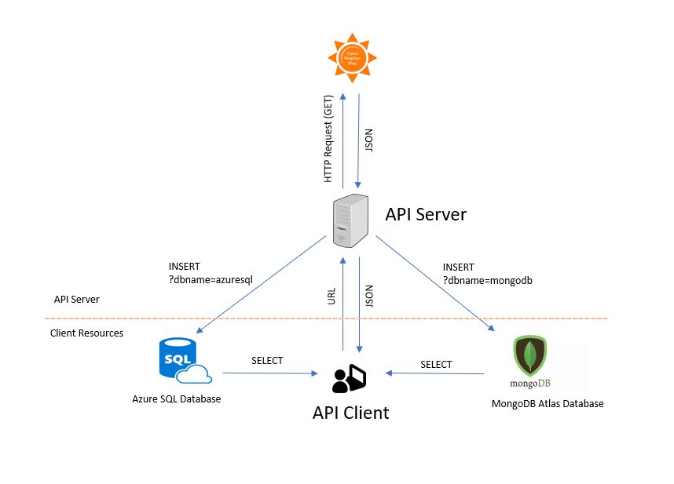
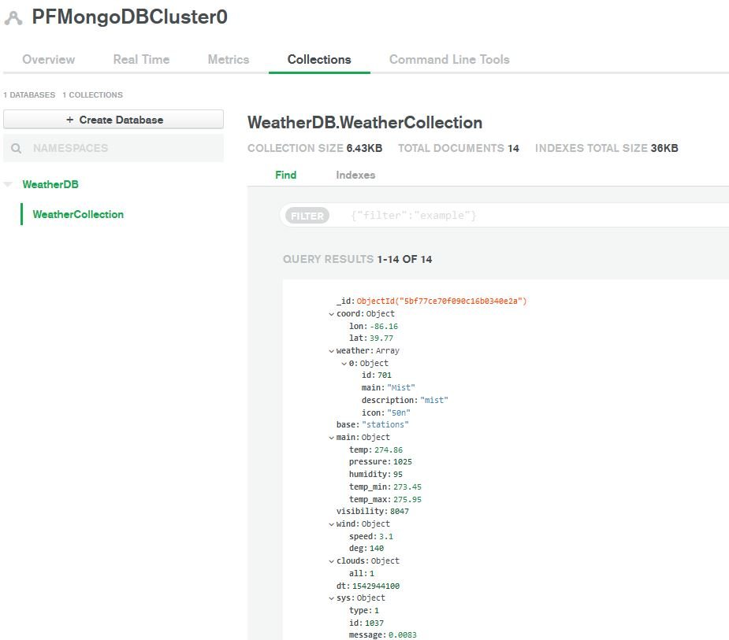
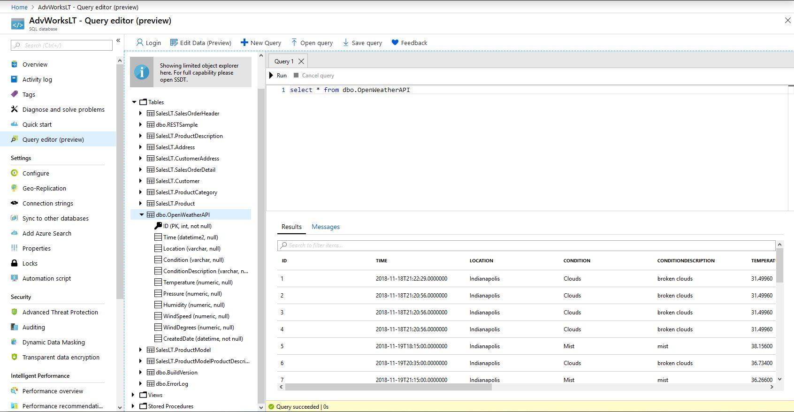

# Creating a RESTful API Service Using MongoDB and Azure :hand: fa18-516-06

| Paul Filliman
| pfillima@iu.edu
| Indiana University
| hid: fa18-516-06
| github: [:cloud:](https://github.com/cloudmesh-community/fa18-516-06/blob/master/paper/paper.md)

---

Keywords: Azure, MongoDB, Swagger, OpenWeatherMap

---

## Abstract
For the final project, a RESTful API service was created using weather data through the OpenWeatherMap API that retrieves current weather information and stores this information to a persisted data store in either a MongoDB database or an Azure SQL Server database. A user can use this API service in one step to retrieve and store real-time weather data to a personal persisted storage connection.

The goals for this project are to gain experience with creating a RESTful API and use sample data retrieved from a public API to use with MongoDB database as well as as with a relational Azure SQL database.

## Introduction

For this project, we create a REST API service using a swagger yaml file to define our service, server side components to implement the service, creation of a cloud-based MongoDB database using MongoDB Atlas, creation of an Azure SQL Database, and a client side component to call the service through a web URL call.

The data used in this project is current weather data from the public API OpenWeatherMap. Using weather data is simple for the users to understand and provide a real-time data source. The yaml file is structured to retrieve data from the OpenWeatherMap API and the server components use this data to insert into either a MongoDB or an Azure SQL persisted data store. The client user can specify connection strings to their own MongoDB and Azure SQL databases and specify through a URL which data store to which they can persist the data. The user can setup this service to run consistently to insert real-time weather data into their database. Once the user uses this API service to perist data, the user can use this data in analysis.

## Design

The outcome for this project is to build a REST API and have a client user call this API through a URL and have real-time data inserted into either a cloud-based MongoDB database or a cloud-based Azure SQL database. The user will also see the results in a JSON format of the data being inserted into either of the persisted data stores.

As seen in Figure 1, this project can be separated into the client resources and the API server resources. The API server is central to this project. Within the API server components, we have three source files, a Swagger 2.0 yaml file used to outline the sample weather data pull, a server source file in Python to outline the GET/POST routines, and a secondary Python source file to implement the GET/POST routines.

On the API client side, we need to setup a MongoDB database cluster using the cloud-based MongoDB Atlas. We need to create a MongoDB database within this cluster and a collection within the database. We also need to setup an Azure SQL Database server, a database, and construct a table creation script to insert the sample data. The client will store connection credentials for these database servers into a config file.

The outcome will be for the client to send an HTTP request to the API server and to have the real-time data inserted into either MongoDB or Azure SQL using a URL parameter specifier.

## Architecture

The architecture diagram for this project is shown in Figure 1. 

The architecture is separated into five components.

#### API Server

The API server is built using swagger 2.0 The swagger.yaml file identifies which attributes of the weather data that will be received from the OpenWeatherMap API. The swagger.yaml file is used by the server.py source file which outlines the HTTP CRUD method requests. Additionally, a secondary source file, weatherapi.py details the methods used when calling the HTTP requests, parsing the parameters out of the client URL request, parsing the connection information to the databases from a config file, transforming raw weather data into decoded information, and determining the proper persisted data store.

#### API Client

The client uses a simple URL request in the format *http://localhost:5000/weather?dbname?mongodb* or *http://localhost:5000/weather?azuresql>* to retrieve information from the REST service. We are using localhost port 5000 in this project. The client will also need to provide connection information in a configuration file to the MongoDB and or Azure SQL databases to store information in their database(s). 

#### MongoDB Database

The MongoDB database used in this project is the cloud-based MongoDB Atlas database. First a cluster needs to be setup by the user as well as a database in that cluster and a collection in that database to store the non-relational data from the REST service. The cluster used in this project is a free tier MongoDB Atlas M0 Instance cluster using version 4.0.4 on an AWS server.

#### Azure SQL Database

Similar to creating the cloud-based MongoDB database, an Azure SQL Database can be used. For this project, a Basic pricing tier SQL Server server is used. The Basic pricing tier has a max total data size of two gigabytes and is under five USD per month. Once a database server is created, we need to create a database and a table to store the data. Within the table, we need to define type specific columns for character and numeric fields and also provide metadata columns for a primary key and creation dates.

#### OpenWeatherMap API

The OpenWeatherMap public API is where we retrieve our current weather data. The format used to retrieve this is *http://api.openweathermap.org/data/2.5/weather?q=mycityname&appid=myappkey*. Again, For this project, there is a free or minimal cost subscription is used. With the free OpenWeatherMap subscription we can retrieve sixty or fewer api calls per minute.

## Implementation
1. install from requirements.txt
2. create yaml for openweathermap api retrieval
3. create server.py using yaml
4. implement weatherapi.py for GET/POST
5. Makefile

## Technologies Used
swagger, flask, openweathermap api, MongoDB Atlas on AWS, Azure SQL Database

## Results

## Deployment Benchmarks

## Application Benchmarks

## (Limitations)

## Conclusion

## (Work Breakdown)

